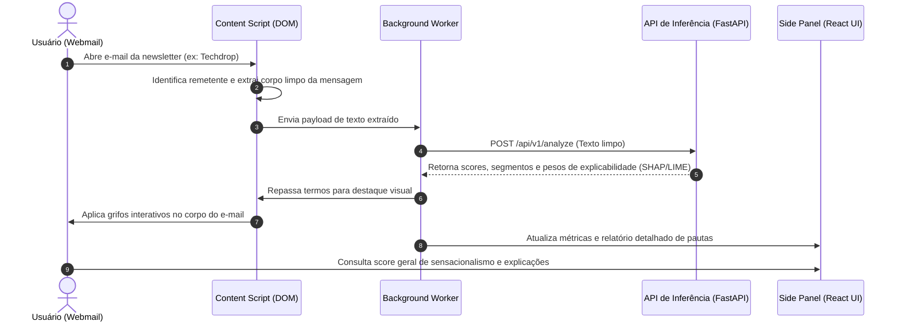

# Arquitetura da Extensão Web

Este documento detalha o fluxo de interação, a stack tecnológica e a organização técnica da extensão de navegador do projeto **Inimigos do Prompt**.

---

## Visão Geral e Fluxo de Uso

A extensão atua integrada ao webmail do usuário (ex.: Gmail, Outlook), analisando newsletters de tecnologia diretamente na aba de leitura para mitigar o consumo de desinformação e sensacionalismo técnico.



---

## Stack Tecnológica

| Camada | Tecnologia | Justificativa Técnica |
| :--- | :--- | :--- |
| **Padrão** | Manifest V3 | Padrão mandatório dos navegadores modernos (Chromium / Firefox), garantindo segurança e conformidade de publicação. |
| **Linguagem** | TypeScript | Tipagem estrita para manipulação segura de seletores do DOM, mensagens internas (`chrome.runtime`) e contratos de payload da API. |
| **Build & Tooling** | Vite + `@crxjs/vite-plugin` | Proporciona suporte a *Hot Module Replacement* (HMR) em ambiente de extensão, acelerando o ciclo de desenvolvimento da UI. |
| **UI Framework** | React 18+ | Renderização reativa do painel lateral e injeções pontuais no DOM via Shadow Root. |
| **Estilização** | Tailwind CSS + Shadow DOM | Isolamento estrito de escopo de estilos para evitar que as classes da extensão interfiram no CSS do webmail e vice-versa. |
| **Componentes** | Radix UI / shadcn/ui + Lucide Icons | Componentes acessíveis, leves e modulares para badges, tooltips de explicabilidade e cartões de pauta. |
| **Estado Local** | Zustand | Gerenciamento de estado leve para sincronizar dados de inferência entre o Content Script e o Side Panel. |

---

## Componentes da Extensão

### 1. Content Script
* **Detecção Contextual:** Identifica remetentes cadastrados ou estruturas típicas de newsletters no DOM da página aberta.
* **Sanitização e Extração:** Isola o nó principal do corpo do e-mail, removendo pixels de rastreamento, links de descadastramento e anúncios periféricos via `DOMPurify` e seletores CSS dedicados.
* **Destaque no Texto (In-line Highlights):** Injeta marcações interativas (`<mark>`) nos trechos pontuados pela explicabilidade do modelo, exibindo tooltips ao passar o cursor sobre termos hiperbólicos.

### 2. Background Service Worker
* Atua como intermediário assíncrono entre os scripts injetados no DOM e os serviços externos.
* Dispara requisições HTTP seguras para a API de inferência do backend.
* Gerencia o armazenamento em cache local (`chrome.storage.local`) de newsletters já processadas para evitar requisições redundantes.

### 3. Side Panel UI
* Interface nativa ancorada via **Chrome Side Panel API** (`chrome.sidePanel`), permitindo leitura simultânea do e-mail e do relatório analítico.
* Exibe o **Score Geral de Sensacionalismo/Hype** da edição e a segmentação de cada pauta tratada no e-mail.

---

## Estrutura de Diretórios Recomendada

```text
extension/
├── manifest.json
├── package.json
├── vite.config.ts
├── src/
│   ├── background/
│   │   └── service-worker.ts       # Gestão de eventos, API e cache local
│   ├── content/
│   │   ├── extractor.ts            # Limpeza e extração de texto do e-mail
│   │   ├── highlighter.ts          # Injeção de grifos e tooltips no DOM
│   │   └── index.ts                # Ponto de entrada do Content Script
│   ├── sidepanel/
│   │   ├── components/             # Componentes React (Cards, Badges, Metrics)
│   │   ├── App.tsx                 # View principal do Side Panel
│   │   └── index.tsx               # Montagem do React no painel lateral
│   ├── services/
│   │   └── api.ts                  # Cliente de comunicação com o backend
│   └── styles/
│       └── globals.css             # Configurações do Tailwind CSS
```
