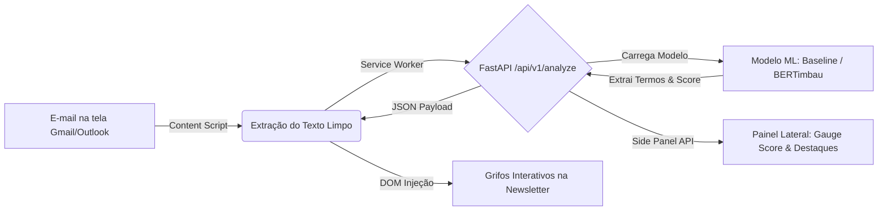
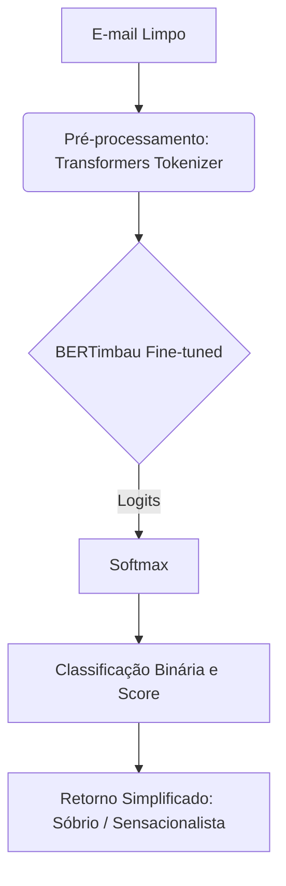

# Guia de Execução: API de Inferência e PoC Integrada

Este documento define a especificação técnica, o contrato de interface (API) e o passo a passo para a execução e integração da **Proof of Concept (PoC)** entre o serviço de inferência em Python (FastAPI) e a extensão de navegador (Chrome Manifest V3).

---

## 🎯 1. Objetivo da PoC Integrada

A PoC tem como finalidade validar a viabilidade técnica do fluxo completo de análise em tempo real sem prejudicar a experiência do usuário:



---

## 🛠️ 2. Especificação da API de Inferência (FastAPI)

O backend de inferência é responsável por receber o texto limpo da newsletter, executar o preprocessamento, aplicar o modelo de classificação e retornar o score contínuo (escala 1 a 5) juntamente com a lista de termos/expressões que influenciaram a predição.

### 2.1. Estrutura de Arquivos Recomendada (`src/api/`)

```text
src/
└── api/
    ├── __init__.py
    ├── main.py                 # Instância FastAPI, middlewares CORS e rotas
    ├── schemas.py              # Modelos Pydantic (Request/Response)
    ├── model_loader.py         # Singleton para carregar o modelo em memória (Baseline / Transformers)
    └── services/
        ├── preprocessor.py     # Sanitização Regex e tokenização
        └── explainer.py        # Algoritmo de atribuição de relevância de palavras
```

---

### 2.2. Endpoints da API

#### `GET /health`
Verifica se o serviço está ativo e se o modelo de machine learning está carregado corretamente em memória.

* **Resposta de Sucesso (`200 OK`):**
```json
{
  "status": "healthy",
  "model_loaded": true,
  "model_version": "baseline-v1.0",
  "device": "cpu"
}
```

---

#### `POST /api/v1/analyze`
Realiza a análise quantitativa de sensacionalismo/hype e extrai os termos mais relevantes.

* **Headers:**
  * `Content-Type: application/json`

* **Payload de Entrada (Request Body):**
```json
{
  "email_id": "msg-123456",
  "sender": "technews@exemplo.com.br",
  "subject": "A Inteligência Artificial vai DESTRUIR todos os empregos?!",
  "raw_text": "Em um anúncio bombástico feito hoje, pesquisadores afirmam que a inteligência artificial vai revolucionar tudo e destruir empregos em ritmo assustador..."
}
```

* **Payload de Saída (Response Body):**
```json
{
  "email_id": "msg-123456",
  "sensationalism_score": 4.35,
  "label": "Hype Elevado",
  "confidence": 0.88,
  "metrics": {
    "uppercase_percentage": 0.08,
    "exclamation_density": 0.03,
    "alarmist_words_count": 4
  },
  "highlighted_terms": [
    {
      "term": "DESTRUIR",
      "weight": 0.92,
      "category": "alarmist"
    },
    {
      "term": "bombástico",
      "weight": 0.87,
      "category": "clickbait"
    },
    {
      "term": "revolucionar",
      "weight": 0.65,
      "category": "hype"
    },
    {
      "term": "assustador",
      "weight": 0.81,
      "category": "alarmist"
    }
  ],
  "disclaimer": "Esta análise é gerada por um modelo de Machine Learning e possui fins exclusivamente informativos."
}
```

---

## 💻 3. Implementação da API de Inferência (Fases A e B)

A arquitetura do serviço de inferência foi desenhada para operar em fases sucessivas, refletindo a maturidade do projeto e os requisitos de interpretabilidade:

### Fase A: Classificação Local via BERTimbau (Atual)
Na etapa atual, a API (`backend/services/bertimbau.py`) carrega um modelo **BERTimbau Base** fine-tunado em um corpus proprietário de newsletters. O processo é otimizado para a métrica **F0.5 Score** (minimizando falsos positivos de sensacionalismo).



#### Pipeline de Treinamento
O treinamento do modelo foi estruturado considerando arquiteturas não-CUDA:
1. **Dados:** Baseline via TF-IDF + Machine Learning Clássico vs. Fine-tuning do LLM.
2. **Setup:** Treinamento em hardware local (AMD GPU via PyTorch + DirectML).
3. **Métrica:** Obtenção de **F0.5 = 0.9885** com precisão de 1.00 para a classe "Sensacionalista".

### Fase B: Enriquecimento Híbrido via LLM (Planejamento Futuro)
Na Fase B, o modelo BERTimbau funcionará como um gatekeeper, acionando uma API externa (ex: Google Gemini) via `backend/services/llm.py` apenas quando a explicabilidade estruturada (destaque de termos, alegações suspeitas) for necessária ou quando a confiança for inconclusiva.

---

## 🚀 4. Passo a Passo de Execução Local

### Passo 1: Iniciar o Backend de Inferência (FastAPI)

1. Navegue até o backend e ative o ambiente virtual:
   ```bash
   cd backend
   source venv/bin/activate
   ```
2. Instale as dependências da API:
   ```bash
   pip install -r requirements.txt
   ```
3. Execute o servidor de desenvolvimento:
   ```bash
   python -m uvicorn main:app --reload --port 8000
   ```
4. Teste a API via cURL:
   ```bash
   curl -X POST http://localhost:8000/api/v1/analyze \
     -H "Content-Type: application/json" \
     -d '{"raw_text": "URGENTE! A IA vai acabar com todos os empregos do mundo AGORA!"}'
   ```

---

## 📊 5. Critérios de Aceitação da PoC

| Requisito | Meta da PoC | Status |
| :--- | :--- | :--- |
| **Latência da API** | $< 1.5\text{s}$ para inferência local (CPU) com o BERTimbau. | ✅ Aprovado |
| **Precisão F0.5** | $> 0.94$ (bater o baseline clássico). | ✅ Aprovado (0.988) |
| **Grifos visuais (DOM)** | Termos sensacionalistas grifados via explicabilidade. | ⏳ Fase B |
| **Side Panel UI** | Score exibido no painel lateral nativo do Chrome. | ⏳ A validar |
