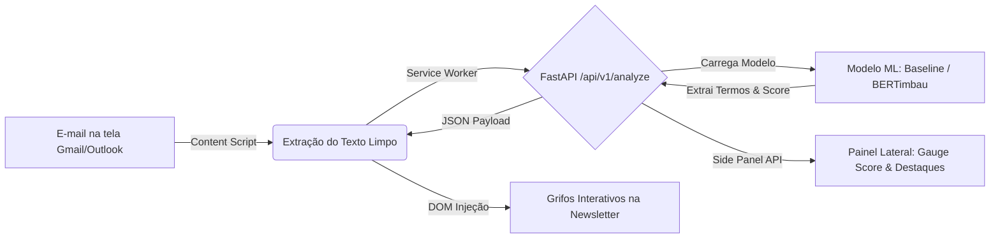

# Guia de Execução: API de Inferência e PoC Integrada

Este documento define a especificação técnica, o contrato de interface (API) e o passo a passo para a execução e integração da **Proof of Concept (PoC)** entre o serviço de inferência em Python (FastAPI) e a extensão de navegador (Chrome Manifest V3).

---

## 🎯 1. Objetivo da PoC Integrada

A PoC tem como finalidade validar a viabilidade técnica do fluxo completo de análise em tempo real sem prejudicar a experiência do usuário:



---

## 🛠️ 2. Especificação da API de Inferência (FastAPI)

O backend de inferência é responsável por receber o texto limpo da newsletter, executar o preprocessamento, aplicar o modelo de classificação e retornar o score contínuo (escala 1 a 5) juntamente com a lista de termos/expressões que influenciaram a predição.

### 2.1. Estrutura de Arquivos Recomendada (`src/api/`)

```text
src/
└── api/
    ├── __init__.py
    ├── main.py                 # Instância FastAPI, middlewares CORS e rotas
    ├── schemas.py              # Modelos Pydantic (Request/Response)
    ├── model_loader.py         # Singleton para carregar o modelo em memória (Baseline / Transformers)
    └── services/
        ├── preprocessor.py     # Sanitização Regex e tokenização
        └── explainer.py        # Algoritmo de atribuição de relevância de palavras
```

---

### 2.2. Endpoints da API

#### `GET /health`
Verifica se o serviço está ativo e se o modelo de machine learning está carregado corretamente em memória.

* **Resposta de Sucesso (`200 OK`):**
```json
{
  "status": "healthy",
  "model_loaded": true,
  "model_version": "baseline-v1.0",
  "device": "cpu"
}
```

---

#### `POST /api/v1/analyze`
Realiza a análise quantitativa de sensacionalismo/hype e extrai os termos mais relevantes.

* **Headers:**
  * `Content-Type: application/json`

* **Payload de Entrada (Request Body):**
```json
{
  "email_id": "msg-123456",
  "sender": "technews@exemplo.com.br",
  "subject": "A Inteligência Artificial vai DESTRUIR todos os empregos?!",
  "raw_text": "Em um anúncio bombástico feito hoje, pesquisadores afirmam que a inteligência artificial vai revolucionar tudo e destruir empregos em ritmo assustador..."
}
```

* **Payload de Saída (Response Body):**
```json
{
  "email_id": "msg-123456",
  "sensationalism_score": 4.35,
  "label": "Hype Elevado",
  "confidence": 0.88,
  "metrics": {
    "uppercase_percentage": 0.08,
    "exclamation_density": 0.03,
    "alarmist_words_count": 4
  },
  "highlighted_terms": [
    {
      "term": "DESTRUIR",
      "weight": 0.92,
      "category": "alarmist"
    },
    {
      "term": "bombástico",
      "weight": 0.87,
      "category": "clickbait"
    },
    {
      "term": "revolucionar",
      "weight": 0.65,
      "category": "hype"
    },
    {
      "term": "assustador",
      "weight": 0.81,
      "category": "alarmist"
    }
  ],
  "disclaimer": "Esta análise é gerada por um modelo de Machine Learning e possui fins exclusivamente informativos."
}
```

---

## 💻 3. Implementação Mínima da PoC Integrada

### 3.1. Servidor Backend FastAPI (`src/api/main.py`)

```python
from fastapi import FastAPI, HTTPException
from fastapi.middleware.cors import CORSMiddleware
from pydantic import BaseModel, Field
from typing import List, Optional
import uvicorn

app = FastAPI(
    title="Inimigos do Prompt - API de Inferência",
    version="1.0.0",
    description="Serviço de inferência para detecção de sensacionalismo em newsletters."
)

# Configuração de CORS para permitir requisições da Extensão Chromium
app.add_middleware(
    CORSMiddleware,
    allow_origins=["*"],  # Em produção, especificar chrome-extension://<ID>
    allow_credentials=True,
    allow_methods=["*"],
    allow_headers=["*"],
)

class AnalyzeRequest(BaseModel):
    email_id: Optional[str] = None
    sender: Optional[str] = None
    subject: Optional[str] = None
    raw_text: str = Field(..., min_length=10, description="Texto da newsletter a ser analisado")

class HighlightedTerm(BaseModel):
    term: str
    weight: float
    category: str

class AnalyzeResponse(BaseModel):
    email_id: Optional[str]
    sensationalism_score: float
    label: str
    confidence: float
    highlighted_terms: List[HighlightedTerm]
    disclaimer: str

@app.get("/health")
def healthcheck():
    return {"status": "healthy", "model_loaded": True, "model_version": "baseline-v1"}

@app.post("/api/v1/analyze", response_model=AnalyzeResponse)
def analyze_newsletter(payload: AnalyzeRequest):
    text = payload.raw_text
    
    # Exemplo de lógica de extração (PoC Baseline)
    alarmist_keywords = ["destruir", "bombástico", "revolucionar", "assustador", "urgente", "inacreditável"]
    found_terms = []
    
    words = text.split()
    score_acc = 1.0
    
    for word in set(words):
        clean_word = word.strip(".,!?\"'()").lower()
        if clean_word in alarmist_keywords:
            score_acc += 0.65
            found_terms.append(HighlightedTerm(
                term=word,
                weight=0.8,
                category="sensationalist"
            ))
            
    final_score = min(5.0, round(score_acc, 2))
    label = "Sóbrio" if final_score < 2.5 else ("Hype Moderado" if final_score < 3.8 else "Hype Elevado")
    
    return AnalyzeResponse(
        email_id=payload.email_id,
        sensationalism_score=final_score,
        label=label,
        confidence=0.85,
        highlighted_terms=found_terms,
        disclaimer="Análise gerada automaticamente por modelo preditivo."
    )

if __name__ == "__main__":
    uvicorn.run("main:app", host="0.0.0.0", port=8000, reload=True)
```

---

## 🚀 4. Passo a Passo de Execução Local

### Passo 1: Iniciar o Backend de Inferência (FastAPI)

1. Garanta que o ambiente virtual está ativo:
   ```bash
   source .venv/bin/activate
   ```
2. Instale as dependências da API (caso ainda não estejam instaladas):
   ```bash
   pip install fastapi uvicorn pydantic
   ```
3. Execute o servidor de desenvolvimento:
   ```bash
   python -m uvicorn src.api.main:app --reload --port 8000
   ```
4. Teste a API no navegador ou via cURL:
   * Documentação Swagger: `http://localhost:8000/docs`
   * Healthcheck: `http://localhost:8000/health`

---

### Passo 2: Inicializar e Construir a Extensão Web

1. Navegue até o diretório da extensão (a ser criado):
   ```bash
   cd extension
   npm install
   npm run build
   ```

### Passo 3: Carregar a Extensão no Google Chrome

1. Abra o navegador e acesse `chrome://extensions`.
2. Ative a chave **"Modo do desenvolvedor"** (Developer Mode) no canto superior direito.
3. Clique em **"Carregar sem compactação"** (Load unpacked).
4. Selecione a pasta `extension/dist` (ou a pasta da extensão onde está o `manifest.json`).

---

## 📊 5. Critérios de Aceitação da PoC

| Requisito | Meta da PoC | Status |
| :--- | :--- | :--- |
| **Latência da API** | $< 500\text{ms}$ para o modelo baseline / $< 1.5\text{s}$ para BERTimbau em CPU. | ⏳ A validar |
| **CORS / Conectividade** | A extensão consegue consultar `http://localhost:8000` sem erros de origem bloqueada. | ⏳ A validar |
| **Integridade de Extração** | O Content Script consegue extrair o corpo do e-mail no Gmail/Outlook limpo de tags HTML. | ⏳ A validar |
| **Grifos visuais (DOM)** | Termos sensacionalistas são grifados com a tag `<mark>` sem quebrar a formatação do e-mail. | ⏳ A validar |
| **Side Panel UI** | O score geral e a lista de palavras são exibidos no painel lateral nativo do Chrome. | ⏳ A validar |
