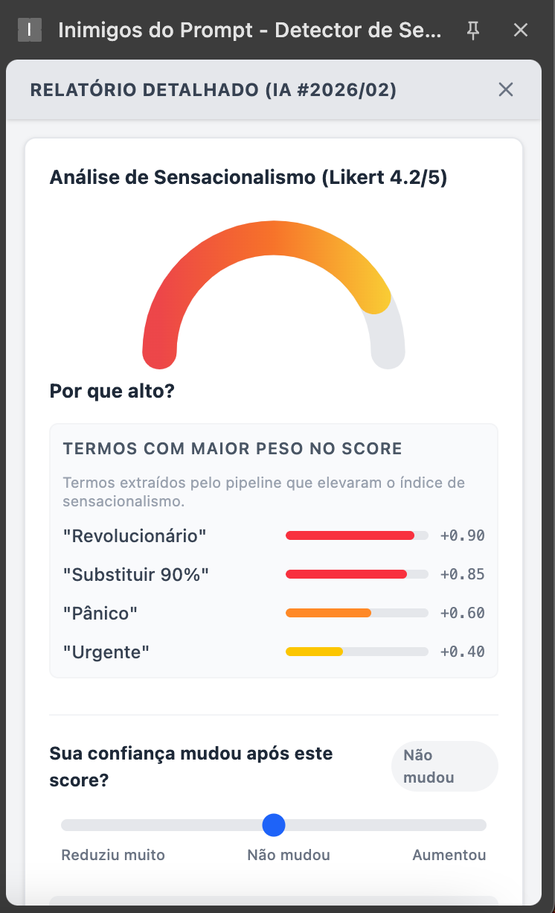
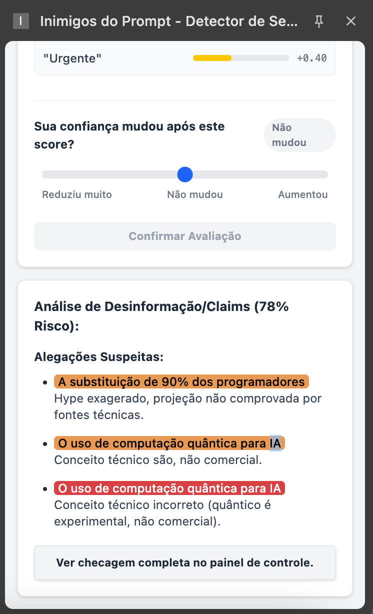
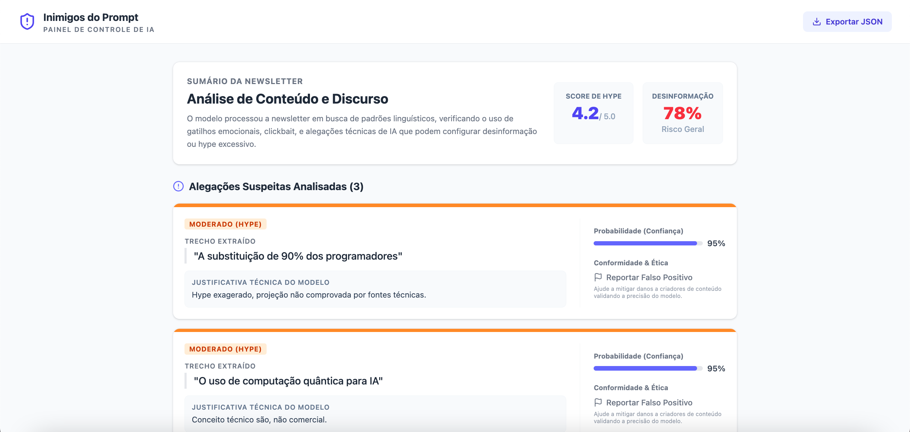
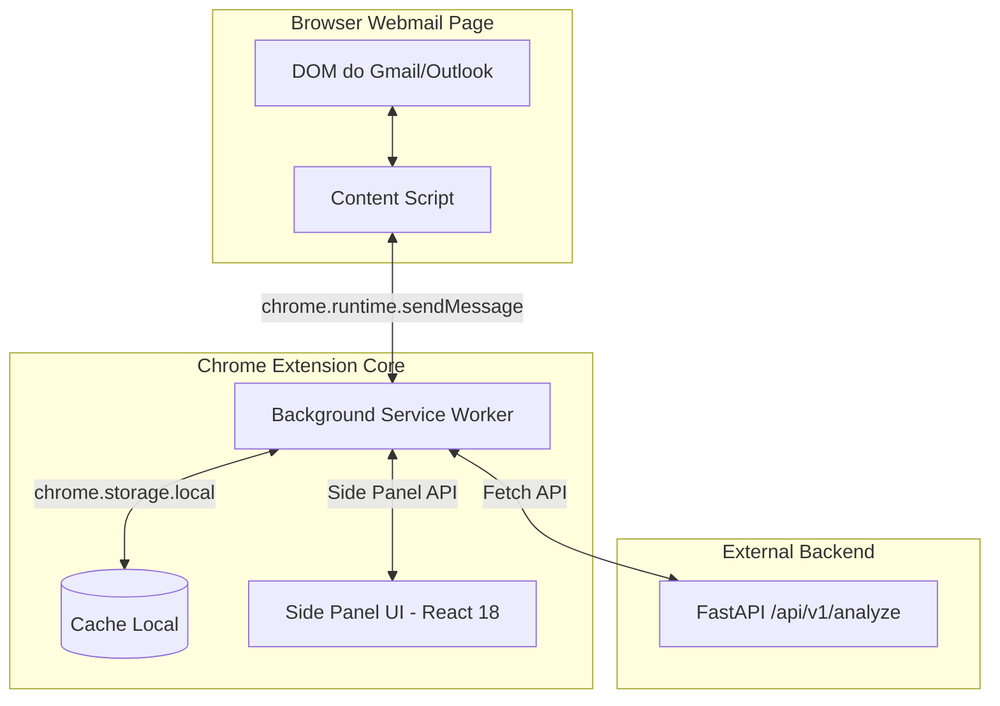

# Especificação e Arquitetura da Extensão Web (Frontend)

Este documento estabelece a especificação técnica completa, a estrutura do projeto e os componentes da **Extensão de Navegador (Manifest V3)** desenvolvida no diretório `extension/` utilizando **React, TypeScript, Vite e Tailwind CSS**.

## 🎨 Interface Visual (Previews)
As funcionalidades de explicabilidade de IA (Feature Attribution), score Likert, e checagem detalhada (Claims) estão dispostas no **Side Panel** e no **Dashboard** (Tela cheia):

<div style="display: flex; gap: 10px;">
  
  
</div>

<br/>


---

## 🏗️ 1. Visão Geral da Arquitetura Frontend

A extensão é construída seguindo o padrão **Chromium Manifest V3** com suporte a Hot Module Replacement (HMR) via `@crxjs/vite-plugin`. A arquitetura é dividida em três pilares principais:



---

## 📂 2. Estrutura de Diretórios Recomendada (`extension/`)

```text
extension/
├── manifest.json                  # Manifesto Chrome V3
├── vite.config.ts                 # Configuração do Vite + CRXJS Plugin
├── package.json                   # Dependências do React, Tailwind e CRXJS
├── tsconfig.json                  # Configurações TypeScript
├── postcss.config.js              # Processamento do Tailwind CSS
├── tailwind.config.js             # Design System e temas de cores
├── src/
│   ├── manifest.ts                # Definição tipada do manifesto (opcional)
│   ├── background/
│   │   └── service-worker.ts      # Gerenciamento de eventos, cache e comunicação HTTP
│   ├── content/
│   │   ├── extractor.ts           # Seleção e sanitização do texto do e-mail no DOM
│   │   ├── highlighter.ts         # Grifos interativos no texto e tooltips
│   │   └── index.ts               # Ponto de entrada do Content Script
│   ├── sidepanel/
│   │   ├── components/            # Componentes visuais do React
│   │   │   ├── ScoreGauge.tsx     # Indicador circular de Sensacionalismo (1.0 a 5.0)
│   │   │   ├── TermCard.tsx       # Card com termo destacado, peso e categoria
│   │   │   └── Header.tsx         # Cabeçalho do painel
│   │   ├── App.tsx                # View principal do Side Panel
│   │   ├── index.html             # HTML do Side Panel
│   │   └── main.tsx               # Ponto de montagem do React
│   ├── services/
│   │   └── api.ts                 # Cliente de integração com o Backend FastAPI
│   ├── types/
│   │   └── index.ts               # Interfaces e Tipos (Payloads e Mensagens)
│   └── styles/
│       └── globals.css            # Estilos globais e utilitários Tailwind
```

---

## 📜 3. Especificação Técnica dos Componentes

### 3.1. `manifest.json` (Chrome Manifest V3)

```json
{
  "manifest_version": 3,
  "name": "Inimigos do Prompt - Detector de Sensacionalismo",
  "version": "1.0.0",
  "description": "Analisa newsletters de tecnologia diretamente no seu e-mail para detectar sensacionalismo e hype.",
  "permissions": [
    "sidePanel",
    "storage",
    "activeTab"
  ],
  "host_permissions": [
    "http://localhost:8000/*",
    "https://*/*"
  ],
  "background": {
    "service_worker": "src/background/service-worker.ts",
    "type": "module"
  },
  "content_scripts": [
    {
      "matches": [
        "https://mail.google.com/*",
        "https://outlook.live.com/*",
        "https://outlook.office.com/*"
      ],
      "js": ["src/content/index.ts"],
      "run_at": "document_idle"
    }
  ],
  "side_panel": {
    "default_path": "src/sidepanel/index.html"
  },
  "icons": {
    "16": "icons/icon-16.png",
    "48": "icons/icon-48.png",
    "128": "icons/icon-128.png"
  }
}
```

---

### 3.2. `src/types/index.ts` (Contrato de Tipos)

```typescript
export interface HighlightedTerm {
  term: string;
  weight: number;
  category: 'alarmist' | 'clickbait' | 'hype' | 'sensationalist';
}

export interface AnalyzeResponse {
  email_id?: string;
  sensationalism_score: number; // Escala 1.0 a 5.0
  label: 'Sóbrio' | 'Hype Moderado' | 'Hype Elevado';
  confidence: number;
  highlighted_terms: HighlightedTerm[];
  disclaimer: string;
}

export interface AnalyzeRequest {
  email_id?: string;
  sender?: string;
  subject?: string;
  raw_text: string;
}

export type ExtensionMessage = 
  | { type: 'ANALYZE_EMAIL'; payload: AnalyzeRequest }
  | { type: 'ANALYSIS_RESULT'; payload: AnalyzeResponse }
  | { type: 'ERROR'; error: string };
```

---

### 3.3. `src/content/extractor.ts` (Extração e Limpeza do DOM)

O script identifica seletores específicos do cliente de e-mail (ex.: `.a3s.aiL` no Gmail):

```typescript
export function extractEmailContent(): { subject: string; bodyText: string } | null {
  // Seletor típico de corpo de mensagem no Gmail
  const gmailBody = document.querySelector('.a3s.aiL');
  const subjectHeader = document.querySelector('h2[data-thread-perm-id]') || document.querySelector('.hP');

  if (!gmailBody) return null;

  const rawHtml = gmailBody.innerHTML;
  
  // Cria elemento temporário para isolar apenas o texto sem tags de estilo e scripts
  const tempDiv = document.createElement('div');
  tempDiv.innerHTML = rawHtml;

  // Remove propagandas conhecidas e elementos de rodapé irrelevantes
  tempDiv.querySelectorAll('script, style, iframe, footer, .unsubscribe').forEach(el => el.remove());

  const cleanText = tempDiv.innerText.replace(/\s+/g, ' ').trim();

  return {
    subject: subjectHeader ? subjectHeader.textContent || '' : '',
    bodyText: cleanText
  };
}
```

---

### 3.4. `src/background/service-worker.ts` (Orquestração e API)

O Service Worker recebe a mensagem do Content Script, verifica o cache local e faz a chamada HTTP para o backend FastAPI:

```typescript
import { AnalyzeRequest, AnalyzeResponse, ExtensionMessage } from '../types';

const API_URL = 'http://localhost:8000/api/v1/analyze';

chrome.runtime.onMessage.addListener((message: ExtensionMessage, _sender, sendResponse) => {
  if (message.type === 'ANALYZE_EMAIL') {
    handleEmailAnalysis(message.payload)
      .then(result => sendResponse({ type: 'ANALYSIS_RESULT', payload: result }))
      .catch(err => sendResponse({ type: 'ERROR', error: err.message }));
    
    return true; // Mantém a porta de resposta assíncrona aberta
  }
});

async function handleEmailAnalysis(payload: AnalyzeRequest): Promise<AnalyzeResponse> {
  const cacheKey = `cache_${payload.subject || ''}_${payload.raw_text.substring(0, 30)}`;
  
  // 1. Verifica no storage local
  const cachedData = await chrome.storage.local.get(cacheKey);
  if (cachedData[cacheKey]) {
    return cachedData[cacheKey];
  }

  // 2. Faz requisição à API FastAPI
  const response = await fetch(API_URL, {
    method: 'POST',
    headers: { 'Content-Type': 'application/json' },
    body: JSON.stringify(payload)
  });

  if (!response.ok) {
    throw new Error(`Erro na API: ${response.statusText}`);
  }

  const data: AnalyzeResponse = await response.json();

  // 3. Salva no cache local
  await chrome.storage.local.set({ [cacheKey]: data });

  return data;
}
```

---

### 3.5. `src/sidepanel/App.tsx` (Interface React do Painel Lateral)

Exemplo de componente principal renderizado no `chrome.sidePanel`:

```tsx
import React, { useState, useEffect } from 'react';
import { AnalyzeResponse } from '../types';

export const App: React.FC = () => {
  const [data, setData] = useState<AnalyzeResponse | null>(null);
  const [loading, setLoading] = useState<boolean>(false);

  useEffect(() => {
    // Escuta atualizações enviadas pelo Content Script ou Background Worker
    chrome.runtime.onMessage.addListener((msg) => {
      if (msg.type === 'ANALYSIS_RESULT') {
        setData(msg.payload);
        setLoading(false);
      }
    });
  }, []);

  if (loading) return <div className="p-4 text-center">Analisando newsletter...</div>;
  if (!data) return <div className="p-4 text-center text-gray-500">Abra um e-mail de newsletter para visualizar a análise.</div>;

  const scoreColor = data.sensationalism_score >= 3.8 ? 'text-red-600' : (data.sensationalism_score >= 2.5 ? 'text-yellow-600' : 'text-green-600');

  return (
    <div className="p-4 space-y-4 font-sans bg-gray-50 min-h-screen">
      <header className="border-b pb-2">
        <h1 className="text-lg font-bold text-gray-800">Inimigos do Prompt</h1>
        <p className="text-xs text-gray-500">Análise de Hype e Sensacionalismo</p>
      </header>

      {/* Metric Card */}
      <div className="bg-white p-4 rounded-xl shadow-sm border text-center">
        <span className="text-xs uppercase tracking-wider text-gray-400 font-semibold">Score de Sensacionalismo</span>
        <div className={`text-4xl font-extrabold my-1 ${scoreColor}`}>
          {data.sensationalism_score.toFixed(1)} <span className="text-sm font-normal text-gray-400">/ 5.0</span>
        </div>
        <span className="inline-block px-3 py-1 rounded-full text-xs font-medium bg-gray-100 text-gray-700">
          {data.label}
        </span>
      </div>

      {/* Highlighted Terms */}
      <div className="bg-white p-4 rounded-xl shadow-sm border space-y-2">
        <h3 className="text-sm font-semibold text-gray-700">Termos em Destaque</h3>
        <div className="flex flex-wrap gap-2">
          {data.highlighted_terms.map((item, idx) => (
            <span key={idx} className="bg-red-50 text-red-700 border border-red-200 text-xs px-2 py-1 rounded-md">
              {item.term} ({Math.round(item.weight * 100)}%)
            </span>
          ))}
        </div>
      </div>

      <footer className="text-xs text-gray-400 text-center pt-2">
        {data.disclaimer}
      </footer>
    </div>
  );
};
```

---

## 🛠️ 4. Configuração do Projeto Vite (`vite.config.ts`)

```typescript
import { defineConfig } from 'vite';
import react from '@vitejs/plugin-react';
import { crx } from '@crxjs/vite-plugin';
import manifest from './manifest.json';

export default defineConfig({
  plugins: [
    react(),
    crx({ manifest }),
  ],
  server: {
    port: 5173,
    strictPort: true,
    hmr: {
      port: 5173,
    },
  },
});
```

---

## 🚀 5. Comandos para Inicialização

1. **Instalação das dependências:**
   ```bash
   cd extension
   npm install
   ```

2. **Modo de Desenvolvimento com HMR:**
   ```bash
   npm run dev
   ```

3. **Build para Produção:**
   ```bash
   npm run build
   ```

4. **Carregamento no Chrome:**
   * Acesse `chrome://extensions`.
   * Ative o **Modo do Desenvolvedor**.
   * Clique em **Carregar sem compactação** e selecione a pasta `extension/dist`.
