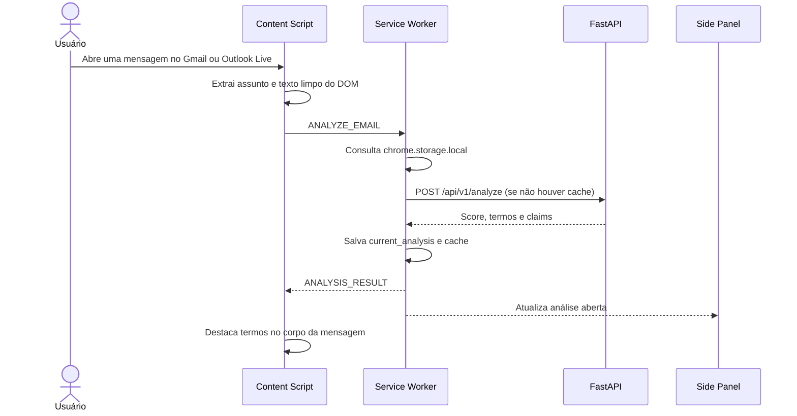

Esta página descreve a implementação atual da PoC, não a arquitetura planejada.

## Fluxo implementado



O content script usa os seletores `.a3s.aiL` no Gmail e `.x_WordSection1` ou `[aria-label="Corpo da mensagem"]` no Outlook. A extração remove scripts, estilos, iframes, `footer` e alguns seletores de descadastro. A API faz uma segunda limpeza de HTML e URLs.

## Componentes existentes

| Camada | Implementação atual |
| --- | --- |
| Manifesto | Chrome Manifest V3 com `sidePanel`, `storage`, `activeTab` e `tabs`. |
| Content script | `src/content/`: extrai a mensagem, solicita a análise e injeta `<mark>` no HTML da mensagem. |
| Service worker | `src/background/service-worker.ts`: faz cache local, chama a API, grava `current_analysis` e transmite o resultado às views abertas. |
| Interface | React 19, TypeScript, Vite, Tailwind e Lucide. O side panel verifica a API, aciona extração, exibe análise real e envia feedback; há também um dashboard (`dashboard.html`). |
| API | FastAPI com cache em memória e artefatos sklearn versionados; sem esses arquivos, usa heurísticas. |

Não há Zustand, Radix/shadcn, DOMPurify, SHAP nem LIME no código atual. A explicabilidade é feita por léxico: palavras alarmistas, texto em caixa alta e alguns padrões de clickbait.

## Estado do painel e do dashboard

O resultado da análise real retorna ao content script para aplicar os grifos. O service worker também o transmite ao side panel e o grava como `current_analysis` no `chrome.storage.local`; o dashboard lê essa chave ao abrir. Assim, as duas interfaces exibem a mesma análise real, inclusive quando ela vem do cache.

O botão da extensão abre o side panel por aba. O painel verifica `GET /health`, pode disparar nova extração na aba ativa e envia `confidence_slider` à API. O dashboard permite exportar o JSON carregado e envia `false_positive` para cada alegação reportada.

## Limitações conhecidas

- A flag `hasAnalyzed` evita reanalisar a mesma página, mas pode impedir nova análise ao trocar de mensagem sem que o corpo desapareça do DOM.
- O highlighter substitui `innerHTML`; isso é adequado apenas à PoC e pode afetar elementos ou listeners do webmail.
- O content script e seus seletores estão limitados a Gmail e Outlook Live. Embora o manifesto declare uma permissão de host para Outlook na web, não há content script configurado para esse domínio.
- A URL da API é fixa em `localhost`, portanto não há configuração de ambiente nem serviço remoto.

## Estrutura efetiva

```text
extension/
├── manifest.json
├── src/
│   ├── background/service-worker.ts
│   ├── content/{extractor,highlighter,index}.ts
│   ├── dashboard/{Dashboard,main}.tsx
│   ├── services/api.ts
│   ├── types/index.ts
│   ├── App.tsx
│   └── main.tsx
├── index.html
└── dashboard.html
```
